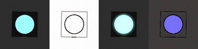
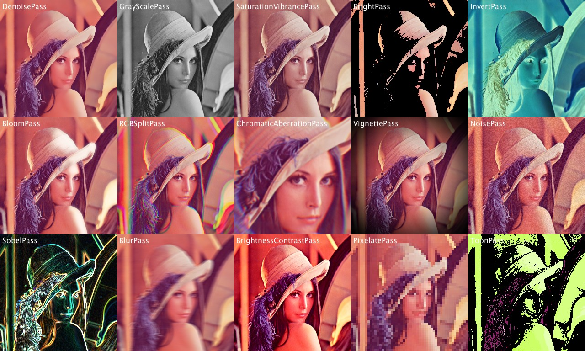
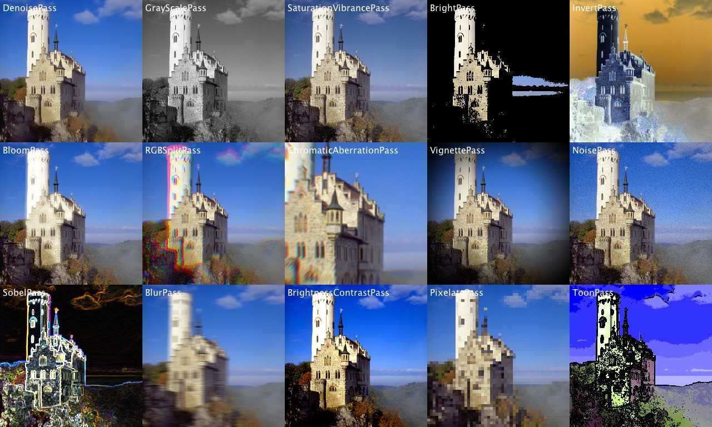
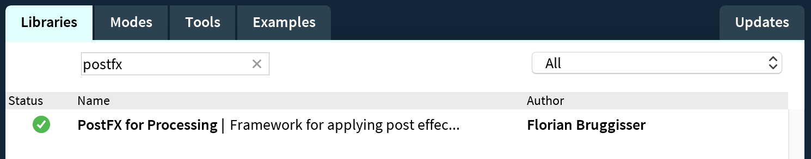

# PostFX for Processing [](https://travis-ci.org/cansik/processing-postfx) [](https://ci.appveyor.com/project/cansik/processing-postfx) [](https://codebeat.co/projects/github-com-cansik-processing-postfx-master)
A simple post effects library for processing.

## Introduction

**PostFX** is a simple post effects library for processing. Post effects are applied to the whole scene after it was rendered, to enhance the scene with some special effects. For example the [bloom effect](https://en.wikipedia.org/wiki/Bloom_(shader_effect)) helps to simulate the light diffusion to be more **realistic**.



*Example of the post effects sobel, bloom and toon.*

### Why did I implement it?

There are a lot of tutorials which help you to implement a bloom filter in OpenGL (e.g. [Learn OpenGL - Bloom](https://learnopengl.com/#!Advanced-Lighting/Bloom)). But for **[processing](https://processing.org/)** I could not find one that is as performant as I needed in my `P3D` renderings.

So I started to implement a simple but fast library to run post effects on `P2D` and `P3D` graphics objects.

### What is included?
Here you find two examples which are based on the [Lenna](examples/DocumentationRendering/data/Lenna.png) and [Lichtenstein](examples/DocumentationRendering/data/Lichtenstein.png) test images:

[](examples/DocumentationRendering/renderings/lennaRendering.png)

[](examples/DocumentationRendering/renderings/lennaRendering.png)

The **PostFX** library currently contains following built in effects:

* bright pass
* blur horizontal
* blur vertical
* sobel edge detection
* toon filter

Version 1.1 adds a lot of new shaders:

#### Color
* Brightness and Contrast Shader
* Saturation and Vibrance Shader
* Invert Shader
* Grayscale Shader

#### Reconstruction
* Denoise Shader

#### Effects
* Bloom Shader
* Pixelate Shader
* Chromatic aberration shader
* Noise Shader
* Vignette Shader
* RGB Split Shader

And there is also a method to run your own custom shaders.

*Some of the shaders are from the [spite/Wagner](https://github.com/spite/Wagner/) respoitory and only adapted to work in processing.*

## Example
There are two API's to use the **PostFX** library. The basic one is very easy and removes responsibility of the **pass management**. The advanced way is, where you have to create pass instances yourself, but have the freedom to manage them by your own.

**Custom shaders** are supported, in the basic and the advanced version.

### Setup
To use the library you have to install it over the processing contribution manager.



Import following packages to use all classes of the **PostFX** library.

```java
import ch.bildspur.postfx.builder.*;
import ch.bildspur.postfx.pass.*;
import ch.bildspur.postfx.*;
```

Use the library on every `PGraphics3D` or `PGraphics2D` object or even on the screen object (`g`).

### Basic Example

To add a post effect to your processing sketch, you just have to create a new `PostFX` object.

```java
PostFX fx;

void setup()
{
  size(500, 500, P3D);
  
  fx = new PostFX(this);  
}
```
Now you have to call the `render()` method of the **PostFX** library. This returns an object, on which you can call all implemented effects.

```java
void draw()
{
  // draw something onto the screen
  background(22);
  box(100);

  // add bloom filter
  fx.render()
    .bloom(0.5, 20, 40)
    .compose();
}
```

Finally you can use `compose()` to draw it onto the main screen (`g` object). It is also possible to compose to onto another `Graphics2D` object.

*Based on [SimpleEffect](examples/SimpleEffect/SimpleEffect.pde) example*

### Off-Screen Buffer

To add a post effect onto a off-screen graphics object, you have to create a new graphics object (`canvas`). To use the basic version of the API, instantiate a new `PostFX` object.

```java
PostFX fx;
PGraphics canvas;

void setup()
{
  size(500, 500, P2D);
  
  fx = new PostFX(this);  
  canvas = createGraphics(width, height, P3D);
}
```
Now you have to draw onto your `canvas` and after rendering, you just pass the canvas into the `render()` method of the **PostFX** library. This returns an object, on which you can call all implemented effects.

```java
void draw()
{
  canvas.beginDraw();
  // draw something onto the canvas
  canvas.endDraw();
  
  blendMode(BLEND);
  image(canvas, 0, 0);

  // add bloom filter
  blendMode(SCREEN);
  fx.render(canvas)
    .brightPass(0.5)
    .blur(20, 50)
    .compose();
}
```

Finally you can use `compose()` to draw it onto the main screen (`g` object). It is also possible to compose to onto another `Graphics2D` object.

*Based on [OffScreenEffect](examples/OffScreenEffect/OffScreenEffect.pde) example*

### Pass Preloading
For performance reasons it is sometimes necessary to preload the pass and compile the shaders before you use it. For this problem, there is the method `preloadPass`.

To preload a pass you have to call the method and pass the `class` type as argument.

```java
void setup()
{
  size(500, 500, P3D);

  fx = new PostFX(this);

  // compile shaders in setup
  fx.preload(BloomPass.class);
  fx.preload(RGBSplitPass.class);
}

```

Everything else works like usual, but you have now compiled your shaders in the `setup()` method and not in the time critical `draw()` method.

*Based on [PassPreloading](examples/PassPreloading/PassPreloading.pde) example*

### Advanced
The advanced version is used as the underlaying layer of the basic API. It does not create the pass objects itself, but gives the freedom to manage them by your own.

Instead of an `PostFX` class you have to create a new `PostFXSupervisor` which handles all the pass buffers. For each pass, you have to create a pass object, which contains the implementation and the parameters.

It is possible to use the same pass object twice, with different parameter settings.

```java
PostFXSupervisor supervisor;
BrightPass brightPass;
SobelPass sobelPass;

PGraphics canvas;

void setup()
{
  size(500, 500, P2D);

  // create supervisor and load shaders
  supervisor = new PostFXSupervisor(this);
  brightPass = new BrightPass(this, 0.3f);
  sobelPass = new SobelPass(this); 

  canvas = createGraphics(width, height, P3D);
}
```

To render the effects onto the canvas, you have to call the `render()` method on the supervisor and pass all the passes.

```java
void draw()
{
  // draw a simple rotating cube around a sphere
  canvas.beginDraw();
  // draw something onto the canvas
  canvas.endDraw();

  blendMode(BLEND);
  image(canvas, 0, 0);

  // add white ring around sphere
  blendMode(SCREEN);
  supervisor.render(canvas);
  supervisor.pass(brightPass);
  supervisor.pass(sobelPass);
  supervisor.compose();
}
```
Finally, the `compose()` method draws the scene onto the main screen. It is possible to draw the result onto another another `Graphics2D` object.

*Based on [AdvancedEffect](examples/AdvancedEffect/AdvancedEffect.pde) example*

### Custom Shader
This tutorial shows how to create a **negate** pass.

To add a custom shader as pass, you have to create a new class which implements the `Pass` interface.

```java
class NegatePass implements Pass
{
  PShader shader;

  public NegatePass()
  {
    shader = loadShader("negateFrag.glsl");
  }

  @Override
    public void prepare(Supervisor supervisor) {
    // set parameters of the shader if needed
  }

  @Override
    public void apply(Supervisor supervisor) {
    PGraphics pass = supervisor.getNextPass();
    supervisor.clearPass(pass);

    pass.beginDraw();
    pass.shader(shader);
    pass.image(supervisor.getCurrentPass(), 0, 0);
    pass.endDraw();
  }
}
```

The shader for this example is very simple and just calculates one minus the color value.

```glsl
#ifdef GL_ES
precision mediump float;
precision mediump int;
#endif

uniform sampler2D texture;

varying vec4 vertColor;
varying vec4 vertTexCoord;

void main() {
    vec4 c = texture2D(texture, vertTexCoord.st) * vertColor;
    c.xyz = 1.0 - c.xyz;
    gl_FragColor = c;
}
```

To use the shader, you have to create a new instance of it and then add it as pass:

```java
// in setup
NegatePass negatePass = new NegatePass();

// in draw
supervisor.render(canvas);
supervisor.pass(negatePass);
supervisor.compose();
```

*Based on [CustomShaderEffect](examples/CustomShaderEffect/) example*

#### Custom Shader Builder Pattern
With version 1.1 it is now also possible to add a custom shader directly to the builder pattern, which simplifies the whole process:

```java
// in setup
NegatePass negatePass = new NegatePass();

// in draw
fx.render()
  .custom(negatePass)
  .compose();
```

## About
*Developed by [Florian Bruggisser](https://github.com/cansik) ([bildspur.ch](https://bildspur.ch)) 2017*
